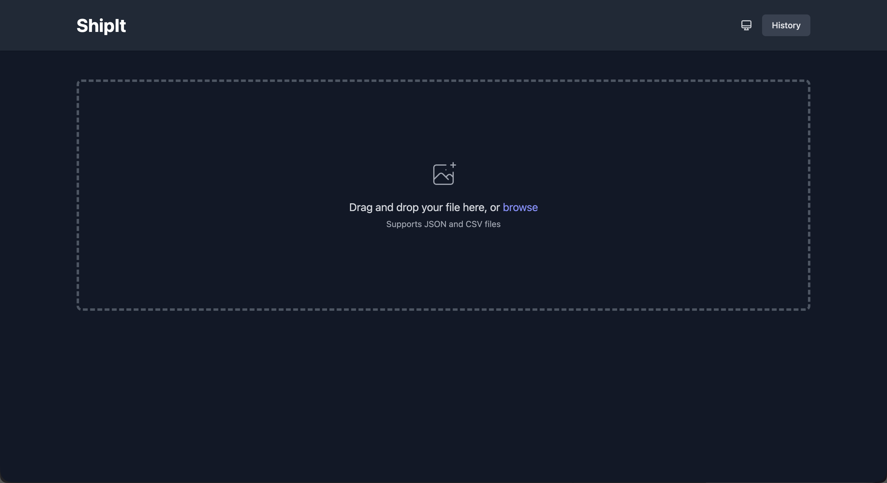
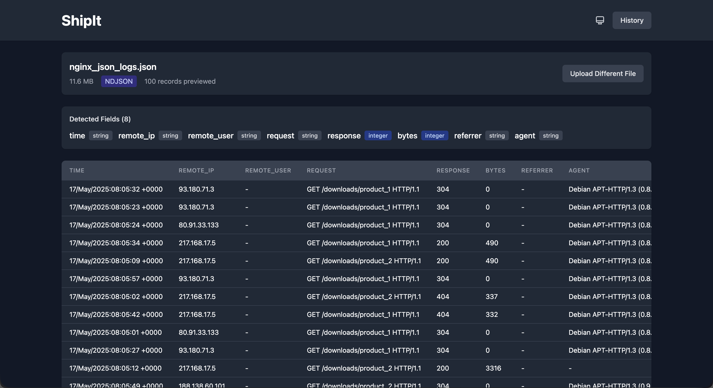
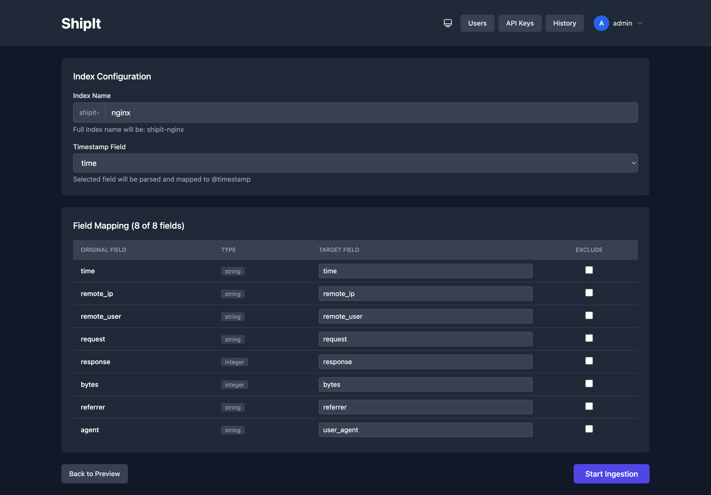
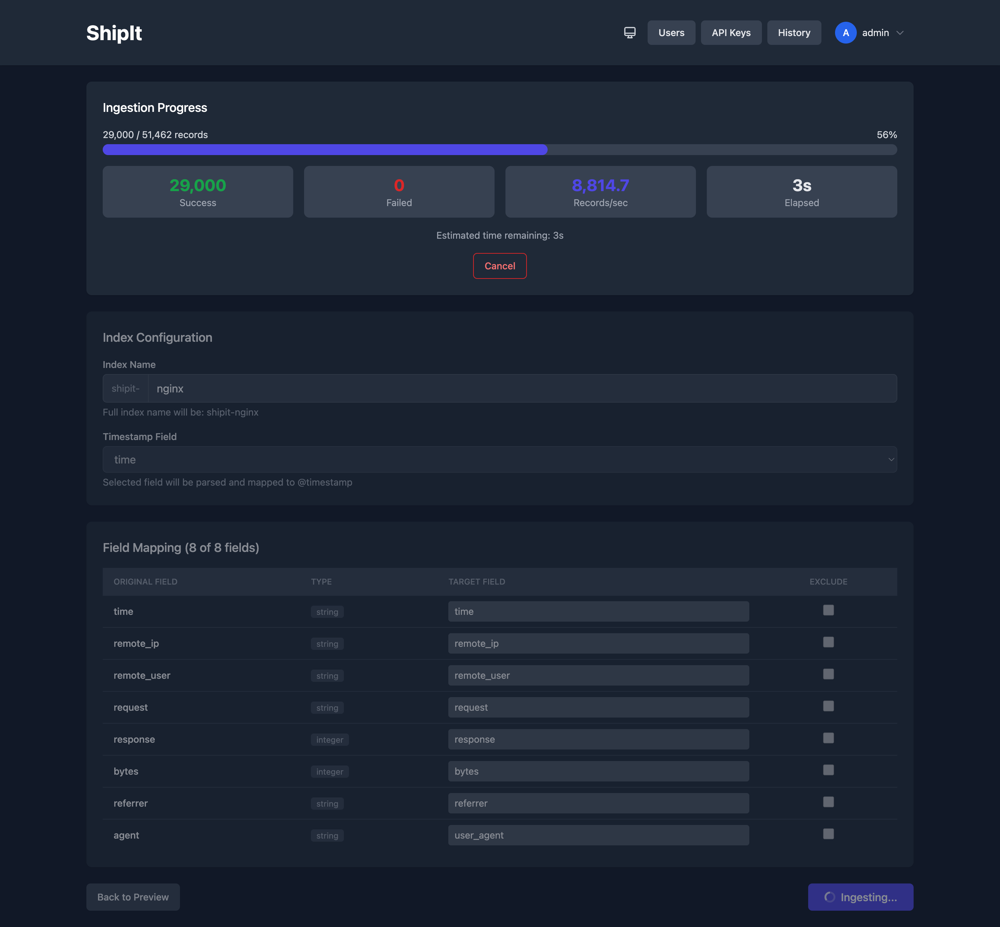
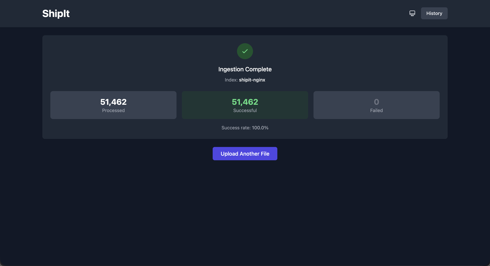
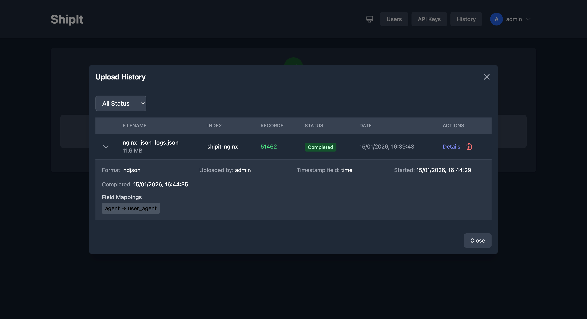
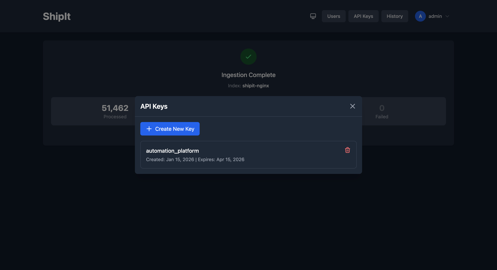
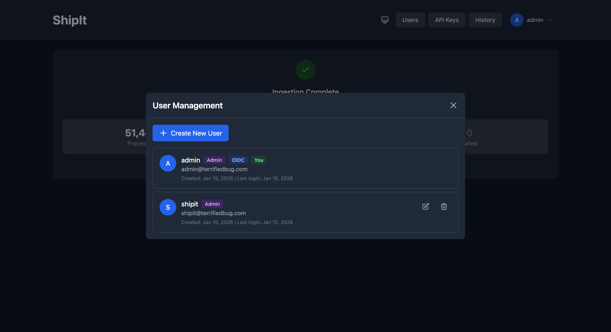

#  ShipIt

Self-service file ingestion tool for OpenSearch. Designed for ad-hoc data uploads during investigations, troubleshooting, and analysis - quickly get JSON, CSV, TSV, LTSV, or syslog data into OpenSearch without writing ingestion pipelines.

## Why ShipIt?

In many organizations, OpenSearch infrastructure is managed by a dedicated platform or SRE team, while the users who need to query and analyze data sit in different teams - security analysts, support engineers, business analysts, and others. These users often need to get ad-hoc data into OpenSearch for investigation or analysis, but they:

- Don't have access to Fluentd, Fluentbit, or Logstash configurations
- Aren't familiar with writing ingestion pipelines
- Just need a quick way to upload a CSV export or JSON log file
- Want to correlate external data with existing OpenSearch indices

ShipIt bridges this gap by providing a simple web interface for self-service data ingestion. No pipeline configuration, no YAML files, no command-line tools - just drag, drop, and query.

> **Note**: ShipIt is a controlled self-service tool for ad-hoc investigations and analysis. It is not a replacement for proper ingestion pipelines and is not intended for production data flows. Use it for temporary, exploratory work where you need data in OpenSearch quickly.

## Tech Stack

- **Frontend**: React + TypeScript with Vite for fast builds and Tailwind CSS for styling
- **Backend**: Python with FastAPI - chosen for its async performance, excellent OpenSearch client support, and readable codebase that's easy to extend
- **Deployment**: Single Docker container with nginx reverse proxy, making it simple to deploy anywhere

## Security & Guardrails

ShipIt is designed for controlled self-service, with guardrails to prevent accidents and maintain accountability:

- **Strict Index Mode**: By default, ShipIt only writes to and deletes indices it created. This prevents accidental overwrites or deletion of production indices or data managed by other pipelines. Disable with `STRICT_INDEX_MODE=false` if you need more flexibility.
- **Index Prefix Isolation**: All indices are prefixed (default: `shipit-`) to clearly separate ad-hoc data from production indices.
- **Authentication Required**: No anonymous access. All users must authenticate via local credentials, OIDC SSO, or API keys.
- **Comprehensive Audit Log**: All security-relevant events are logged including logins (success/failure), user management actions, API key operations, index operations, and ingestion activities. Admins can view and filter audit logs from the UI.
- **Rate Limiting**: Per-user rate limiting (default: 10 uploads/minute) prevents abuse and accidental flooding.
- **Field Count Limits**: Maximum fields per document (default: 1000) prevents OpenSearch mapping explosion from malformed data.
- **API Key Scoping**: Programmatic access via API keys inherits the creating user's permissions, supports expiration dates, and is tracked in audit logs.
- **File Size Limits**: Configurable maximum upload size (default: 500MB) to prevent resource exhaustion.
- **SSL Verification**: SSL certificate verification is enabled by default for OpenSearch connections.
- **Session Security**: HTTP-only cookies with configurable session duration.

## Features

- **Authentication**: Local users, OIDC SSO, and API keys for automation
- **User Management**: Admin UI for creating/editing/deleting users
- **OIDC SSO**: Enterprise single sign-on with auto-provisioning and group-based roles
- **Drag-and-drop upload**: JSON, NDJSON, CSV, TSV, LTSV, and syslog formats
- **Multi-file upload**: Combine multiple files of the same format into a single index
- **Auto-detection**: File format and field type inference
- **Field mapping**: Rename, exclude, and configure fields before ingestion
- **Timestamp parsing**: Automatic UTC conversion for various formats
- **Real-time progress**: Live ingestion status via Server-Sent Events
- **Upload history**: Track all uploads with user attribution and audit trail
- **Index management**: Delete indices directly from History
- **Dark mode**: Full dark theme support

## Screenshots

| Login | Upload |
|-------|--------|
|  |  |

| Preview | Configure |
|---------|-----------|
|  |  |

| Live Progress | Progress Complete |
|---------------|-------------------|
|  |  |

| History | API Keys |
|---------|----------|
|  |  |

| User Management |
|-----------------|
|  |

## Quick Start (Development)

1. Clone the repository
2. Copy `.env.example` to `backend/.env` and configure:

```bash
OPENSEARCH_HOST=https://your-opensearch:9200
OPENSEARCH_USER=your-user
OPENSEARCH_PASSWORD=your-password
```

3. Start the development environment:

```bash
docker compose -f compose.dev.yaml up
```

4. Open http://localhost:8080

## Production Deployment

### Using Docker Compose (Recommended)

```bash
docker compose up -d
```

### Using Docker directly

```bash
docker run -d -p 80:80 --env-file .env \
  -v shipit-data:/data \
  ghcr.io/terrifiedbug/shipit:latest
```

### Building from source

```bash
docker build -t shipit .
docker run -p 80:80 --env-file .env shipit
```

## Environment Variables

### Required

| Variable | Description |
|----------|-------------|
| `OPENSEARCH_HOST` | OpenSearch URL (must include `https://`) |
| `OPENSEARCH_USER` | OpenSearch username |
| `OPENSEARCH_PASSWORD` | OpenSearch password |
| `SESSION_SECRET` | Secret key for signing session cookies (change in production!) |

### Optional

| Variable | Default | Description |
|----------|---------|-------------|
| `INDEX_PREFIX` | `shipit-` | Prefix for all created indices |
| `STRICT_INDEX_MODE` | `true` | Block writes to indices not created by ShipIt (prevents accidental overwrites) |
| `OPENSEARCH_VERIFY_CERTS` | `true` | Verify SSL certificates when connecting to OpenSearch |
| `MAX_FILE_SIZE_MB` | `500` | Maximum upload file size in MB |
| `MAX_FIELDS_PER_DOCUMENT` | `1000` | Maximum fields per document to prevent mapping explosion (0 to disable) |
| `UPLOAD_RATE_LIMIT_PER_MINUTE` | `10` | Maximum uploads per minute per user (0 to disable) |
| `SESSION_DURATION_HOURS` | `8` | How long user sessions remain valid |
| `APP_URL` | - | Public URL for CORS and OIDC callbacks (e.g., `https://shipit.example.com`) |
| `FAILURE_FILE_RETENTION_HOURS` | `24` | How long to keep failed record files |
| `BULK_BATCH_SIZE` | `1000` | Number of records per bulk insert to OpenSearch |

### OIDC SSO (Optional)

| Variable | Description |
|----------|-------------|
| `OIDC_ENABLED` | Set to `true` to enable OIDC SSO |
| `OIDC_ISSUER_URL` | OIDC provider issuer URL (e.g., `https://idp.example.com`) |
| `OIDC_CLIENT_ID` | OIDC client ID |
| `OIDC_CLIENT_SECRET` | OIDC client secret |
| `OIDC_ALLOWED_DOMAIN` | Optional: restrict to email domain (e.g., `example.com`) |
| `OIDC_ADMIN_GROUP` | Optional: group name that grants admin role (e.g., `shipit-admins`) |

## Required OpenSearch Permissions

The OpenSearch user needs these permissions:

- `cluster_monitor` - Required for health check endpoint
- `crud` on `shipit-*` indices - Read/write documents
- `create_index` on `shipit-*` indices - Create new indices
- `indices:monitor/stats` and `indices:monitor/settings/get` on `shipit-*` indices - Required for History and strict index mode validation
- `delete_index` on `shipit-*` indices - Required for "Delete Index" option when cancelling ingestion (optional)

Example OpenSearch security role:

```json
{
  "cluster_permissions": ["cluster_monitor"],
  "index_permissions": [{
    "index_patterns": ["shipit-*"],
    "allowed_actions": ["crud", "create_index", "delete_index", "indices:monitor/stats", "indices:monitor/settings/get"]
  }]
}
```

## Supported File Formats

- **JSON Array**: `[{"field": "value"}, ...]`
- **NDJSON**: One JSON object per line
- **CSV**: Comma or semicolon delimited with header row
- **TSV**: Tab-separated values with header row
- **LTSV**: Labeled Tab-separated Values (`label:value\tlabel:value`)
- **Syslog**: RFC 3164 and RFC 5424 syslog message formats

## Timestamp Handling

When you select a timestamp field, ShipIt:

1. Parses various formats (ISO8601, nginx/Apache CLF, epoch seconds/milliseconds)
2. Converts to UTC
3. Creates an `@timestamp` field for OpenSearch index patterns

Supported formats:
- ISO8601: `2024-01-15T10:30:00Z`
- Nginx/Apache: `17/May/2015:08:05:02 +0000`
- Epoch seconds: `1705312200`
- Epoch milliseconds: `1705312200000`

## Authentication

### First-Time Setup

When no users exist, ShipIt prompts for initial admin registration. The first user is automatically an admin.

### Session Authentication

Users log in with email/password and receive a session cookie valid for `SESSION_DURATION_HOURS` (default 8 hours). Sessions are HTTP-only cookies for security.

### OIDC Single Sign-On

ShipIt supports OIDC SSO for enterprise deployments. When enabled:

1. Users see "Sign in with SSO" as the primary login option
2. Local login remains available as a fallback
3. New users are auto-provisioned on first login
4. Optional domain restriction limits which email domains can authenticate
5. Admin role can be assigned based on group membership from the IdP

**OIDC Setup:**

1. Register ShipIt as a client in your IdP
2. Set the callback URL to `{APP_URL}/api/auth/callback`
3. Configure the OIDC environment variables (see above)
4. Ensure the IdP returns `email`, `name`, and optionally `groups` claims

### User Management (Admin Only)

Admins can manage local users via the **Users** button in the header:

- **Create users**: Set email, name, initial password, and admin status
- **Edit users**: Update name, toggle admin, reset password
- **Deactivate/Activate users**: Temporarily disable accounts without deleting
- **Delete users**: Soft-delete (preserves upload history, allows re-registration)

Users created by admins must change their password on first login. Deactivated users cannot log in but retain their upload history.

### API Keys

For programmatic access (scripts, CI/CD pipelines), users can create API keys:

1. Log in to ShipIt
2. Click **API Keys** in the header
3. Click **Create New Key**, set name and expiry
4. Copy the key (shown only once)

API keys inherit the creating user's permissions and are tracked in audit logs.

### Programmatic Upload API

Use the `/api/v1/upload` endpoint for single-shot file ingestion:

```bash
curl -X POST https://shipit.example.com/api/v1/upload \
  -H "Authorization: Bearer YOUR_API_KEY" \
  -F "file=@data.json" \
  -F "index_name=my-logs" \
  -F "timestamp_field=time" \
  -F "include_filename=true"
```

**Parameters:**

| Parameter | Required | Description |
|-----------|----------|-------------|
| `file` | Yes | File to upload |
| `index_name` | Yes | Target index name (prefix added automatically) |
| `format` | No | Force format: `json`, `ndjson`, `csv`, `tsv`, `ltsv`, `syslog` (auto-detected if omitted) |
| `timestamp_field` | No | Field to parse as `@timestamp` |
| `include_filename` | No | Add source filename to each record (`true`/`false`) |
| `filename_field` | No | Name of filename field (default: `source_file`) |

**Response:**

```json
{
  "status": "completed",
  "index_name": "shipit-my-logs",
  "records_ingested": 1000,
  "records_failed": 0,
  "duration_seconds": 1.23
}
```

If any records fail, `status` will be `completed_with_errors` and an `errors` array will be included.